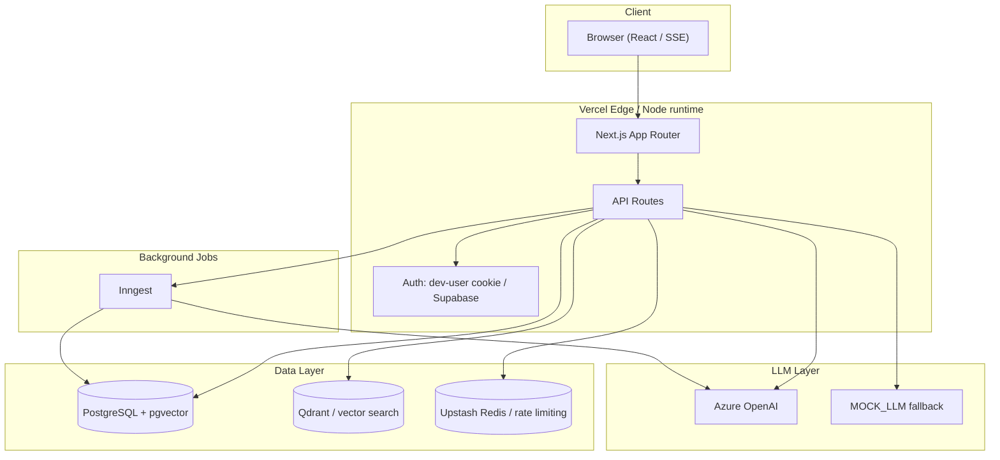

# Production Handoff — PF Copilot

**Version:** 0.1.0  
**Date:** 2026-08-25  
**Repository:** `imaxtiwari/pf-copilot`  
**Production URL:** https://pf-copilot-eight.vercel.app  

---

## 1. Architecture overview

PF Copilot is a Next.js 16 App Router application backed by PostgreSQL + pgvector, Azure OpenAI, and an optional Qdrant vector store. It is an **educational tool for Indian retail investors** and must never emit investment advice.

### Key modules

| Module | Responsibility |
|--------|----------------|
| `app/api/*` | HTTP API surface; all routes return the standardized `ok`/`err` envelope. |
| `lib/orchestrator.ts` | Multi-tool chat orchestrator with cost budget, safety classifier, and citations. |
| `lib/safety/classifier.ts` | Server-side no-advice guardrail; defaults to `safe` on failure. |
| `lib/rag/*` | Strict-RAG fund explainer, stock explainer, and fund comparator. |
| `lib/cas/*` | NSDL/CDSL CAS PDF parsing, validation, and review sessions. |
| `lib/portfolio/*` | Portfolio allocation, snapshots, XIRR, and deterministic insights. |
| `lib/inflation/*` | Personal inflation engine (pure, deterministic, fully unit-tested). |
| `lib/db.ts` | Lazy-initializing Drizzle + pg `Pool` proxy to avoid build-time env validation. |
| `lib/azure-openai.ts` | Azure OpenAI client factory with mock fallback for dev/test. |
| `db/schema.ts` + `db/migrations/*` | Drizzle schema and incremental migrations. |

---

## 2. Deployment checklist

### Pre-deployment

- [ ] All secrets are stored in Vercel environment variables, never in source control.
- [ ] `DATABASE_URL` points to a PostgreSQL 15+ instance with the `pgvector` extension enabled.
- [ ] Azure OpenAI deployments are created for `gpt-4o`, `gpt-4o-mini`, and `text-embedding-3-large`.
- [ ] Qdrant collections are created with the same embedding dimension as `EMBEDDING_DIMENSION`.
- [ ] Supabase project is configured and RLS policies are enabled.
- [ ] Upstash Redis is provisioned for production rate limiting.
- [ ] `COOKIE_SECRET` is a strong random string.
- [ ] `ALLOW_LEGACY_DEV_USER` is **not** set in production.
- [ ] `MOCK_LLM` is **not** set to `true` in production.

### Deploy

---

## 3. Required environment variables

| Variable | Required | Description |
|----------|----------|-------------|
| `DATABASE_URL` | Yes | PostgreSQL connection string. |
| `AZURE_OPENAI_ENDPOINT` | Yes* | Azure OpenAI resource endpoint. |
| `AZURE_OPENAI_API_KEY` | Yes* | Azure OpenAI API key. |
| `AZURE_OPENAI_API_VERSION` | Yes* | API version (e.g. `2024-10-21`). |
| `AZURE_OPENAI_DEPLOYMENT_GPT4O` | Yes* | GPT-4o deployment name. |
| `AZURE_OPENAI_DEPLOYMENT_GPT4O_MINI` | Yes* | GPT-4o-mini deployment name. |
| `AZURE_OPENAI_DEPLOYMENT_EMBEDDING` | Yes* | text-embedding deployment name. |
| `NEXT_PUBLIC_SUPABASE_URL` | Yes | Supabase project URL. |
| `NEXT_PUBLIC_SUPABASE_ANON_KEY` | Yes | Supabase anon/public key. |
| `SUPABASE_SERVICE_ROLE_KEY` | Optional | Service role for admin ops; keep secret. |
| `UPSTASH_REDIS_REST_URL` | Yes* | Upstash Redis REST URL. |
| `UPSTASH_REDIS_REST_TOKEN` | Yes* | Upstash Redis REST token. |
| `QDRANT_URL` | Optional | Qdrant server URL. |
| `QDRANT_COLLECTIONS` | Optional | Comma-separated collection names to health-check. |
| `EMBEDDING_DIMENSION` | Optional | Embedding dimension (default `1536`). |
| `SAFETY_CLASSIFIER_ENABLED` | Optional | Set `false` to disable the LLM safety check (not recommended). |
| `MOCK_LLM` | Dev only | Use deterministic mock instead of Azure. |
| `ALLOW_LEGACY_DEV_USER` | Dev only | Enable legacy dev-user cookie auth. |
| `LOG_LEVEL` | Optional | `trace`, `debug`, `info`, `warn`, `error`, `fatal`. |
| `COOKIE_SECRET` | Yes | Strong random string for cookie signing. |

\* Required in production. Local development can run with `MOCK_LLM=true` if Azure credentials are not available.

---

## 4. Runbooks

### 4.1 LLM outage or degraded latency

**Symptoms:** `/api/chat` returns 503/504, `chat_latency_ms` histogram spikes, Azure errors in logs.

1. Check Azure OpenAI status page.
2. Enable `MOCK_LLM=true` only as a temporary degradation for non-production environments.
3. If a specific deployment is down, update the deployment env var to a fallback deployment.
4. Reduce `maxToolIterations` or disable non-essential tools in `DEFAULT_ORCHESTRATOR_CONFIG`.
5. Communicate to users: "The assistant is experiencing high load; responses may be slower."

### 4.2 Database outage

**Symptoms:** `/api/health` DB check fails, queries time out, `db` proxy throws on first use.

1. Verify `DATABASE_URL` connectivity from the Vercel function logs.
2. Check PostgreSQL connection pool usage; scale pool size if necessary.
3. If using Supabase, verify the project is not paused.
4. Restore from the latest backup if data loss occurred.
5. The app will fail fast on missing `DATABASE_URL`; ensure env vars are set.

---

## 5. Security checklist

- [ ] **Secrets:** No secrets in source, tests, logs, or fixtures (verified with `gitleaks detect`).
- [ ] **Env vars:** All sensitive values are injected at runtime; `.env.local` is in `.gitignore`.
- [ ] **Authentication:** API routes use `getCurrentUser()` and return `unauthorizedResponse()` when absent.
- [ ] **Authorization:** Supabase RLS policies are defined in `db/migrations/0001_rls_policies.sql`.
- [ ] **Rate limiting:** Production uses Upstash Redis; local dev falls back to in-memory.
- [ ] **Input validation:** All API routes validate inputs with Zod where applicable.
- [ ] **PDF handling:** CAS PDF buffers are memory-only; raw bytes are never persisted.
- [ ] **No advice guardrail:** `NO_ADVICE_CLAUSE` is embedded in prompts and a server-side classifier enforces it.
- [ ] **Dependencies:** `npm audit` findings are documented and mitigated (see FINAL_REPORT.md).

---

## 6. Performance baseline

| Operation | Expected p95 | Notes |
|-----------|--------------|-------|
| `/api/health` | < 100 ms | DB + Redis + Azure health checks. |
| `/api/chat` | 2–8 s | Depends on tool iterations and LLM latency. Budget: 12 s. |
| `/api/chat/stream` | 1–6 s | First event to final event. |
| `/api/cas/review-session` | 3–10 s | PDF text + optional vision extraction. |
| `/api/portfolio/insights` | < 500 ms | Cached; backfill on demand can take 1–3 s. |
| `/api/portfolio/holdings` | < 300 ms | Indexed user-scoped query. |

### Token cost baseline (USD)

| Model | Use case | Blended cost / 1k tokens |
|-------|----------|--------------------------|
| GPT-4o-mini | Orchestrator, safety classifier | ~$0.000375 |
| GPT-4o | Vision CAS fallback, complex explanations | ~$0.005–$0.015 |
| text-embedding-3-large | Factsheet / stock embeddings | ~$0.00013 |

Set `TOKEN_COST_PER_1K_USD` to override the orchestrator default.

---

## 7. Monitoring and alerting

### Structured logs

All services emit pino JSON logs. Key log lines:

| Message | Level | Meaning |
|---------|-------|---------|
| `orchestrator: turn complete` | info | Successful chat turn. |
| `orchestrator: failed to increment user cost` | warn | Cost update failed; non-fatal. |
| `safety classifier returned invalid schema` | warn | Classifier fallback to `safe`. |
| `orchestrator: advice detected in final output` | warn | Refusal served. |
| `metric: chat_refusal_total` | info | Counter for refusals by reason. |
| `metric: chat_latency_ms` | info | Histogram per turn. |

### Recommended alerts

| Alert | Threshold | Severity |
|-------|-----------|----------|
| Error rate > 1% | 5-minute window | page |
| `/api/chat` p95 > 12 s | 10-minute window | warning |
| Rate-limit blocks > 10/min | 5-minute window | warning |
| `monthly_cost` > $5 / user | daily | warning |
| `monthly_cost` > $20 / user | daily | critical |
| Safety refusals > 5% of turns | daily | warning |

### Health endpoints

- `GET /api/health` — liveness + DB + Redis.
- `GET /api/health/deep` — includes Azure OpenAI + Qdrant connectivity.

---

## 8. Known issues and mitigations

| Issue | Impact | Mitigation |
|-------|--------|------------|
| `npm audit` high/critical findings in transitive deps (Next.js, postcss, sharp, etc.) | Potential security exposure. | Documented in FINAL_REPORT.md; plan upgrade path to Next.js 16.3.2+ and latest toolchain. |
| Local E2E blocked by migration journal drift. | Cannot run Playwright against local dev DB until fixed. | Fixed `_journal.json` to include `0003` and `0004`; local DBs created via `push` need `__drizzle_migrations` seeded before `db:migrate` can run. |
| GitHub Actions Node.js 20 deprecation warnings. | Non-breaking CI noise. | Bump `actions/checkout`, `actions/setup-node`, `actions/upload-artifact` to v4 Node 20 versions. |

---

## 9. Contacts and escalation

- **On-call engineer:** TBD
- **Azure OpenAI support:** https://azure.microsoft.com/support
- **Vercel status:** https://www.vercel-status.com
- **Supabase status:** https://status.supabase.com

### 4.3 Queue / background job backlog

**Symptoms:** Inngest dashboard shows pending jobs, AMFI sync is stale, factsheet ingestion lags.

1. Check Inngest function logs for failed runs.
2. Inspect `db/migrations/0004_ingestion_job_queue.sql` schema and job state table.
3. Replay failed jobs from the Inngest dashboard.
4. If backlog is due to rate limits, reduce `sync:amfi` concurrency.

### 4.4 Safety incident (advice leaked)

**Symptoms:** Safety classifier returns `advice` label, user reports a recommendation, audit log shows refusal.

1. Retrieve the conversation from `/api/chat/audit` using the `request_id`.
2. Inspect the final assistant message and the tool traces.
3. If a tool produced advice-like content, tighten the tool prompt in `lib/prompts/*`.
4. Add a regression eval case in `tests/eval/`.
5. If the classifier mis-classified, review `lib/safety/classifier.ts` thresholds.

- [ ] Run `npm run vercel-build` locally or push to `main` to trigger Vercel.
- [ ] Verify migrations applied successfully (`npm run db:migrate`).
- [ ] Verify `/api/health/deep` returns HTTP 200.
- [ ] Verify `/api/health` returns DB + Azure connectivity OK.
- [ ] Run the E2E smoke suite against the production deployment.
- [ ] Enable branch protection requiring `quality`, `test`, and `build` to pass.

### Post-deployment

- [ ] Configure log drains (Vercel → your observability stack).
- [ ] Set up alerts on error rate, p95 latency, and rate-limit blocks.
- [ ] Review the first 24 hours of safety classifier refusals.
